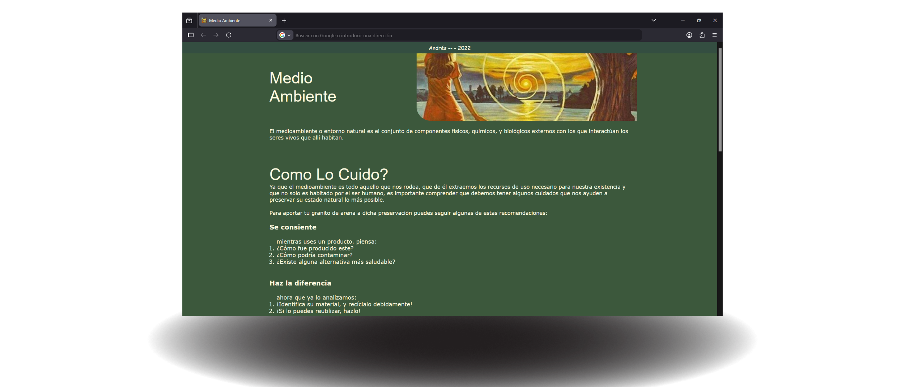
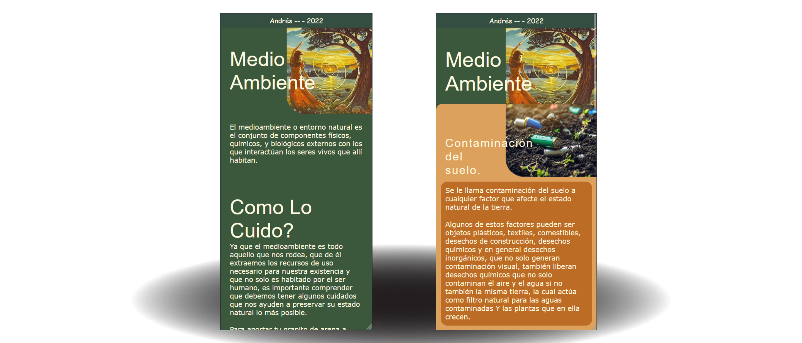

# medio ambiente

En el año 2022 como trabajo de informatica se nos pidió crear una pagina web sencilla referente a la tematica del medio ambiente. Para ello, cree esta pagina sencilla con html y css, no utilizé javascript para temas de funcionalidad ya que no estaba dentro de lo que se nos estaba enseñando en clase y por tanto, no se solicitaba.

## Vista web

## Vista movil
